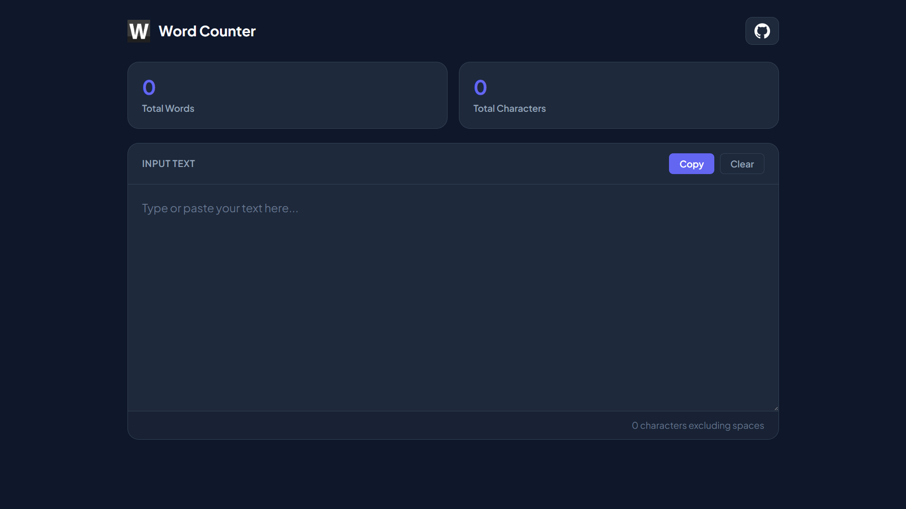

# Word Counter
A responsive web application for real-time word and character count analysis. Built with vanilla HTML5, CSS and JavaScript.

## Website Preview

  

## Features
- Real-Time Counting
- Space-Excluded Character Count
- Quick Copy & Clear
- Clean & Dark UI

## Live Demo
- [Word Counter Live App](https://niloyahsan1.github.io/word-count/)

## Developed By
- [Niloy Ahsan](https://github.com/niloyahsan1)